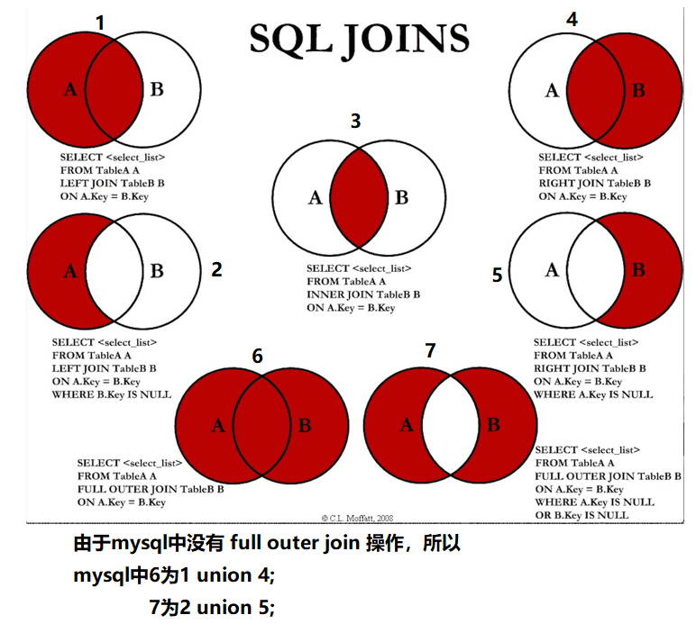
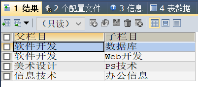

# MySQL学习记录 —— OrangeCH3
## 1.1 初识MySQL

> 为什么要学习数据库

- 岗位技能需求
- 现在的世界,得数据者得天下
- 存储数据的方法
- 程序,网站中,大量数据如何长久保存
- **数据库是几乎软件体系中最核心的一个存在**

> 什么是数据库

数据库(**DataBase**, 简称**DB**)

**概念**: 长期存放在计算机内,有组织,可共享的大量数据的集合,是一个数据 "仓库"

**作用**: 保存,并能安全管理数据(如:增删改查等),减少冗余...

**数据库总览**：

- 关系型数据库(SQL)
    + MySQL, Oracle, SQL Server, SQLite, DB2, ...
    + 关系型数据库通过外键关联来建立表与表之间的关系
- 非关系型数据库(NOSQL)
    + Redis, MongoDB, ...
    + 非关系型数据库通常指数据以对象的形式存储在数据库中，而对象之间的关系通过每个对象自身的属性来决定

> 什么是DBMS    

数据库管理系统(**D**ata**B**ase **M**anagement **S**ystem)

数据库管理软件, 科学组织和存储数据, 高效地获取和维护数据

> MySQL简介

**概念**: 是现在流行的开源的,免费的 关系型数据库

**历史**: 由瑞典 MySQL AB 公司开发，目前属于 Oracle 旗下产品

**特点**：

- 免费, 开源数据库
- 小巧, 功能齐全
- 使用便捷
- 可运行于 Windows 或 Linux 操作系统
- 可适用于中小型甚至大型网站应用

## 1.2 DML/DQL语言学习

> 结构化查询语句分类

- DDL(数据定义语言): CREATE, DROP, ALTER
- **DML**(数据操作语言): INSERT, UPDATE, DELETE
- **DQL**(数据查询语言): SELECT
- DCL(数据控制语言): GRANT, commit, rollback

> DML语言学习

```mysql
INSERT INTO sunditto.student
VALUES (10, 'WangWu', '654321', '男', '1999-01-01', 'Spark','123456@qq.com');

INSERT INTO sunditto.student
VALUES (7, 'WangKe', '654321', '女', '1999-11-11', 'Spark','wangke1111@qq.com');

INSERT INTO sunditto.student
VALUES (6, 'WangKe', '654321', '男', '1999-11-11', 'Spark','wangke1111@qq.com');

-- 这是一条分割线
UPDATE sunditto.student
SET email='sunlin0824@qq.com' 
WHERE id = 8;

UPDATE sunditto.student
SET email='hanjie1225@qq.com' 
WHERE id = 9;

UPDATE sunditto.student
SET email='wangwu0101@qq.com' 
WHERE id = 10;

UPDATE sunditto.student
SET birthday=TIME(NOW())
WHERE id = 7;

-- 这是一条分割线
DELETE FROM sunditto.student 
WHERE id = 6;

-- 测试delete和truncate的区别
CREATE TABLE test (
id INT NOT NULL AUTO_INCREMENT,
coll VARCHAR(20) NOT NULL,
PRIMARY KEY (id)
)ENGINE=INNODB DEFAULT CHARSET = utf8mb4;

INSERT INTO test (coll)
VALUES ('1'), ('2'), ('3');

DELETE FROM test; -- 不会影响主键自增

INSERT INTO test (`coll`)
VALUES ('1'), ('2'), ('3');

TRUNCATE TABLE test; -- 主键自增会重新计数

INSERT INTO test (coll)
VALUES ('1'), ('2'), ('3');
```

> DQL语言学习

```mysql
SELECT * FROM sunditto.student
WHERE id = 7;
CREATE DATABASE IF NOT EXISTS `school`;
-- 创建一个school数据库
USE `school`;-- 创建学生表
DROP TABLE IF EXISTS `student`;
CREATE TABLE `student`(
    `studentno` INT NOT NULL COMMENT '学号',
    `loginpwd` VARCHAR(20) DEFAULT NULL,
    `studentname` VARCHAR(20) DEFAULT NULL COMMENT '学生姓名',
    `sex` TINYINT DEFAULT NULL COMMENT '性别，0或1',
    `gradeid` INT DEFAULT NULL COMMENT '年级编号',
    `phone` VARCHAR(50) NOT NULL COMMENT '联系电话，允许为空',
    `address` VARCHAR(255) NOT NULL COMMENT '地址，允许为空',
    `borndate` DATETIME DEFAULT NULL COMMENT '出生时间',
    `email` VARCHAR (50) NOT NULL COMMENT '邮箱账号允许为空',
    `identitycard` VARCHAR(18) DEFAULT NULL COMMENT '身份证号',
    PRIMARY KEY (`studentno`),
    UNIQUE KEY `identitycard`(`identitycard`),
    KEY `email` (`email`)
)ENGINE=MYISAM DEFAULT CHARSET=utf8mb4;

-- 创建年级表
DROP TABLE IF EXISTS `grade`;
CREATE TABLE `grade`(
    `gradeid` INT NOT NULL AUTO_INCREMENT COMMENT '年级编号',
    `gradename` VARCHAR(50) NOT NULL COMMENT '年级名称',
    PRIMARY KEY (`gradeid`)
) ENGINE=INNODB AUTO_INCREMENT = 6 DEFAULT CHARSET = utf8mb4;

-- 创建科目表
DROP TABLE IF EXISTS `subject`;
CREATE TABLE `subject`(
    `subjectno`INT NOT NULL AUTO_INCREMENT COMMENT '课程编号',
    `subjectname` VARCHAR(50) DEFAULT NULL COMMENT '课程名称',
    `classhour` INT DEFAULT NULL COMMENT '学时',
    `gradeid` INT DEFAULT NULL COMMENT '年级编号',
    PRIMARY KEY (`subjectno`)
)ENGINE = INNODB AUTO_INCREMENT = 19 DEFAULT CHARSET = utf8mb4;

-- 创建成绩表
DROP TABLE IF EXISTS `result`;
CREATE TABLE `result`(
    `studentno` INT NOT NULL COMMENT '学号',
    `subjectno` INT NOT NULL COMMENT '课程编号',
    `examdate` DATETIME NOT NULL COMMENT '考试日期',
    `studentresult` INT  NOT NULL COMMENT '考试成绩',
    KEY `subjectno` (`subjectno`)
)ENGINE = INNODB DEFAULT CHARSET = utf8mb4;

-- 插入学生数据 其余自行添加 这里只添加了2行
INSERT INTO `student` (`studentno`,`loginpwd`,`studentname`,`sex`,`gradeid`,`phone`,`address`,`borndate`,`email`,`identitycard`)
VALUES
(1000,'123456','张伟',0,2,'13800001234','北京朝阳','1980-1-1','text123@qq.com','123456198001011234'),
(1001,'123456','赵强',1,3,'13800002222','广东深圳','1990-1-1','text111@qq.com','123456199001011233');

-- 插入成绩数据  这里仅插入了一组，其余自行添加
INSERT INTO `result`(`studentno`,`subjectno`,`examdate`,`studentresult`)
VALUES
    (1000,1,'2013-11-11 16:00:00',85),
    (1000,2,'2013-11-12 16:00:00',70),
    (1000,3,'2013-11-11 09:00:00',68),
    (1000,4,'2013-11-13 16:00:00',98),
    (1000,5,'2013-11-14 16:00:00',58);

-- 插入年级数据
INSERT INTO `grade` (`gradeid`,`gradename`) VALUES(1,'大一'),(2,'大二'),(3,'大三'),(4,'大四'),(5,'预科班');

-- 插入科目数据
INSERT INTO `subject`(`subjectno`,`subjectname`,`classhour`,`gradeid`)VALUES
    (1,'高等数学-1',110,1),
    (2,'高等数学-2',110,2),
    (3,'高等数学-3',100,3),
    (4,'高等数学-4',130,4),
    (5,'C语言-1',110,1),
    (6,'C语言-2',110,2),
    (7,'C语言-3',100,3),
    (8,'C语言-4',130,4),
    (9,'Java程序设计-1',110,1),
    (10,'Java程序设计-2',110,2),
    (11,'Java程序设计-3',100,3),
    (12,'Java程序设计-4',130,4),
    (13,'数据库结构-1',110,1),
    (14,'数据库结构-2',110,2),
    (15,'数据库结构-3',100,3),
    (16,'数据库结构-4',130,4),
    (17,'C#基础',130,1);

-- 这是一条分割线
SELECT studentno, studentname FROM student;

SELECT CONCAT('姓名：',studentname) AS newname FROM student;

-- 去重操作
SELECT DISTINCT studentno FROM result;

-- 附加操作
SELECT VERSION(); -- 查询系统版本
SELECT 110*3-1 AS 结果; -- 用来计算结果
SELECT @@auto_increment_increment; -- 查询自增的步长
SELECT studentno, studentresult+2 AS '加上平时成绩后的分数' FROM result;

-- WHERE条件子句
SELECT studentno, studentresult FROM result
WHERE studentresult>=80 AND studentresult<=100;

SELECT studentno, studentresult FROM result
WHERE studentresult BETWEEN 80 AND 100;

SELECT studentno, studentresult FROM result
WHERE NOT studentresult=95;

-- 模糊查询
-- %->代表任意多个字符, _->代表一个字符
SELECT studentno,studentname FROM student
WHERE studentname LIKE '%张%';

-- IN关键字的应用
SELECT studentno,studentname FROM student
WHERE studentno IN (1000,1001);

-- IS NOT NULL的应用
SELECT studentno,studentname FROM student
WHERE phone IS NOT NULL;
```

> JOIN联表查询学习



```mysql
-- JOIN联表查询
-- 查询参加了考试的同学（学号、姓名、科目编号、分数）
SELECT * FROM student;
SELECT * FROM result;

-- INNER JOIN查询方式
SELECT s.studentno,studentname,subjectno,studentresult
FROM student AS s
INNER JOIN result AS r
ON s.studentno = r.studentno;

-- RIGHT JOIN查询方式
SELECT s.studentno,studentname,subjectno,studentresult
FROM student s
RIGHT JOIN result r
ON s.studentno = r.studentno;

-- LEFT JOIN查询方式
SELECT s.studentno,studentname,subjectno,studentresult
FROM student s
LEFT JOIN result r
ON s.studentno = r.studentno;
```

|查询操作|具体描述|
|:---:|:---:|
|INNER JOIN|如果两个表中至少有一个匹配，就返回行结果|
|RIGHT JOIN|会从左表中返回查询行结果，即使右表中没有匹配|
|LEFT JOIN|会从右表中返回查询行结果，即使左表中没有匹配|

> 自连接查询学习

```mysql
CREATE TABLE school.category( 
categoryid INT NOT NULL COMMENT 'id',
pid INT NOT NULL COMMENT '父id,没有父则为1', 
categoryname VARCHAR(10) NOT NULL COMMENT '种类名字', 
PRIMARY KEY (categoryid) 
) ENGINE=INNODB CHARSET=utf8mb4;

INSERT INTO category (categoryid, pid, categoryname) 
VALUES (2, 1, '信息技术');
INSERT INTO category (categoryid, pid, categoryname) 
VALUES (3, 1, '软件开发');
INSERT INTO category (categoryid, pid, categoryname) 
VALUES (5, 1, '美术设计');
INSERT INTO category (categoryid, pid, categoryname) 
VALUES (4, 3, '数据库');
INSERT INTO category (categoryid, pid, categoryname) 
VALUES (8, 2, '办公信息');
INSERT INTO category (categoryid, pid, categoryname) 
VALUES (6, 3, 'Web开发');
INSERT INTO category (categoryid, pid, categoryname) 
VALUES (7, 5, 'PS技术');

-- 查询父子信息
SELECT fu.categoryname AS '父栏目',zi.categoryname AS '子栏目'
FROM category AS fu, category AS zi
WHERE fu.categoryid=zi.pid;
```



> 分页和排序学习

```mysql
-- 排序ORDER BY
SELECT subjectname,classhour
FROM SUBJECT
ORDER BY classhour DESC;

-- 分页LIMIT
SELECT subjectname,classhour
FROM SUBJECT
ORDER BY classhour DESC
LIMIT 0,5;

-- 综合查询
SELECT s.studentno, studentname, subjectname, studentresult
FROM student s
INNER JOIN result r
ON s.studentno = r.studentno
INNER JOIN `subject` sub
ON sub.subjectno = r.subjectno
WHERE subjectname = 'Java程序设计-1' AND studentresult>=60
ORDER BY studentresult DESC
LIMIT 0,10;
```

> 子/嵌套查询学习

```mysql
-- 1 使用连接查询
SELECT studentno, r.subjectno, studentresult
FROM result r
INNER JOIN `subject` sub
ON r.subjectno = sub.subjectno
WHERE subjectname = '高等数学-1'
ORDER BY studentresult DESC;

-- 2 使用子查询
SELECT studentno, subjectno, studentresult
FROM result
WHERE subjectno = (
	SELECT subjectno 
	FROM `subject`
	WHERE subjectname = '高等数学-1'
)
ORDER BY studentresult DESC;
```

## 1.3 MySQL函数学习

> 常用函数学习

```mysql
-- 数学运算
SELECT ABS(-8); -- 绝对值
SELECT CEILING(9.4); -- 向上取整
SELECT FLOOR(9.7); -- 向下取整
SELECT RAND(); -- 返回一个0~1之间的随机数
SELECT SIGN(10); -- 判断一个数的符号

-- 字符串函数
SELECT CHAR_LENGTH('OrangeCH3'); -- 字符串长度
SELECT CONCAT('OrangeCH3->','Sun'); -- 字符串拼接
SELECT INSERT('HelloWorld!',6,5,'OrangeCH3'); -- 字符串替换
SELECT LOWER('DIT-FFT'); -- 转换为大写
SELECT UPPER('earth'); -- 转换为小写
SELECT SUBSTR('DIF-FFT',3,4); -- 返回指定参数的字符串
SELECT REVERSE('Apple'); -- 字符串反转

-- 时间和日期函数
SELECT CURRENT_DATE(); -- 获取当前日期
SELECT CURDATE(); -- 同上
SELECT NOW(); -- 获取当前的时间
SELECT LOCALTIME(); -- 获取本地时间
SELECT SYSDATE(); -- 获取系统时间
SELECT DAY(NOW()); -- 获取当前时间的DAY信息

-- 系统函数
SELECT SYSTEM_USER(); -- 获取当前系统用户
SELECT USER(); -- 获取当前用户
SELECT VERSION(); -- 获取当前MySQL版本信息
```

> 聚合函数学习

TODO